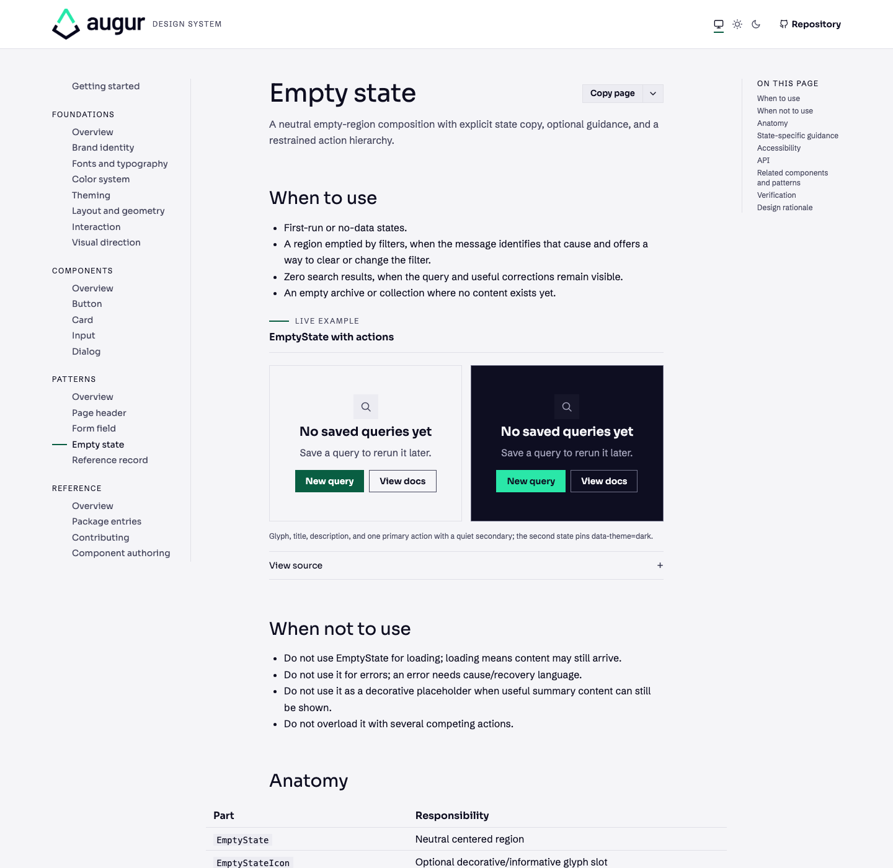
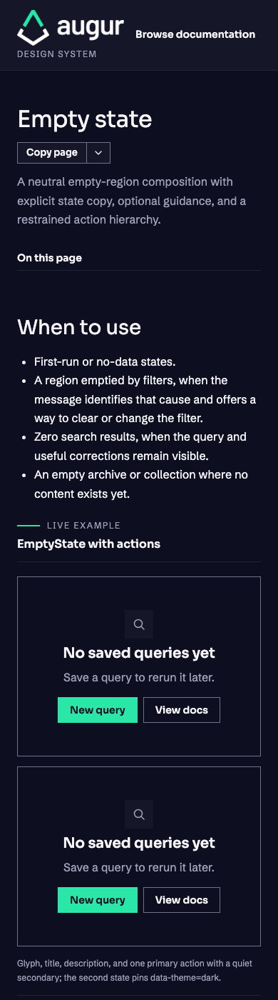
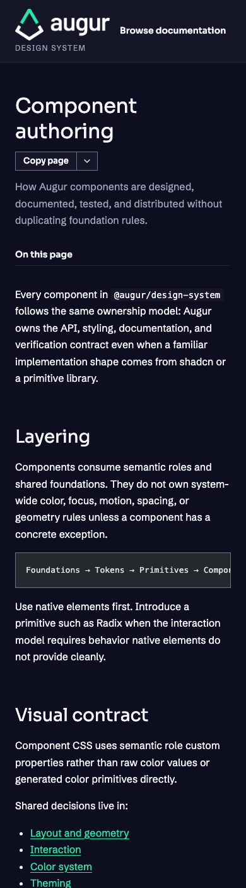

# Review corrections for #53

Local corrections pass; deployed acceptance remains pending. Based on merged #78 (`466f64b`). Captured 22–23 September 2026 in Chromium.

The EmptyState previews now paint their semantic foreground/background in symmetric wrappers without changing the transparent component contract. Fenced code inherits Shiki foreground; inline code keeps its semantic treatment. The matrix checks the computed web-font roles actually used, allowing normal nearest-weight matching and synthesis while requiring loaded Sora and Schibsted families.

## Verification

- Frozen install and docs build passed.
- Design/code lint, root typecheck, workspace, token drift and controlled failures, registry drift, Markdown parity passed; exact commands in [checks.json](checks.json).
- `bun run test`: 70 unit/accessibility tests passed.
- `bun run test:browser`: 71 browser tests passed, including new contrast regressions and existing keyboard/focus checks.
- `bun apps/docs/fixtures/acceptance/capture-matrix.mjs <output-directory>`: 138/138 combinations passed; [summary](verification-summary.json) records fonts, themes, dimensions, console/network status and overflow. Screenshot filenames in that full-run summary identify the retained local capture archive; only the four representative crops below are committed here.

The source commit in the summary is the base commit; its dirty-diff hash identifies the tested working changes. Screenshots were inspected independently of the implementing worker, at 1440×1000, 768×1024 and 390×844 in both themes. These representative crops were taken before the final runner-only font assertion adjustment; application code and rendering did not change.

## Rendered evidence

## Remaining gates and limitations

The live site still reproduces both original contrast defects. Merge and deployment require maintainer action; recheck the exact deployed revision before accepting or closing #53, then link acceptance to #22. Consumer-sample restructuring is tracked separately in #79.

The optional docs-specific typecheck has pre-existing missing JSX and NavLink errors in ThemeToggle.tsx and sections.ts, reproduced in the untouched checkout. Required root typecheck passes. Controlled content-failure scenarios and independent consumer installation were not rerun: their infrastructure/package sources did not change. No cross-engine claim is made. The in-app browser blocked localhost navigation; local visual evidence uses the existing Chromium capture fixture. Deployed checks used the in-app browser.
